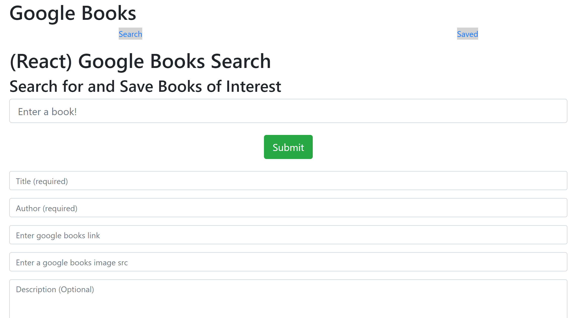

# Description

This application allows users to search and add Google books using React.
A user may search the database for a book and return data such as
the title, the author(s), the description, the image, and the link to 
the book on Google Books. Users may also post their own books if they
have a title and author(s) to submit in the form.

# Preview

# Link to Application

Google Books on Heroku: [Link](https://my-react-google-books-search.herokuapp.com/)
